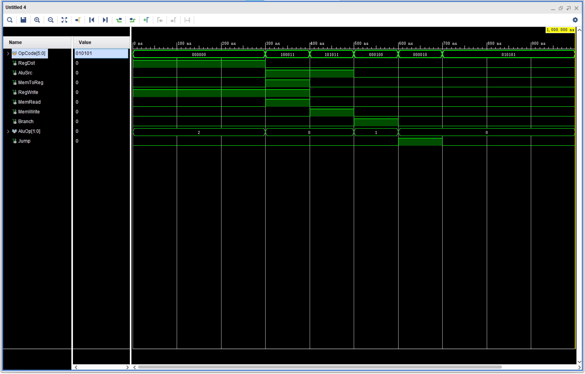
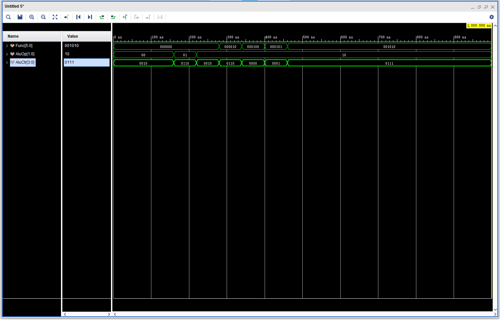
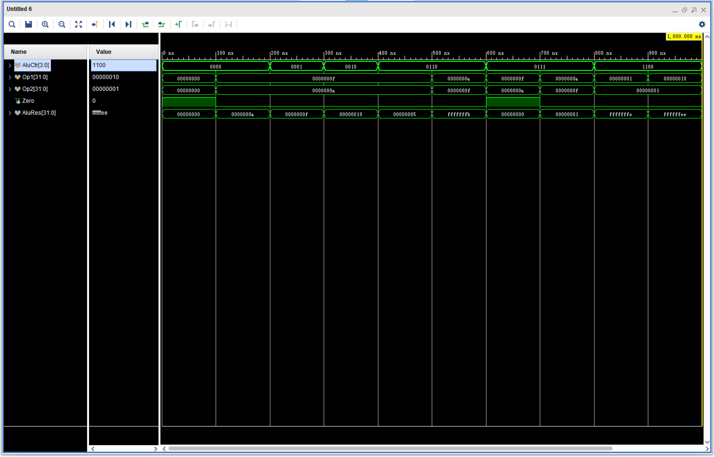

# 计算机系统结构试验报告 lab3  

张鼎言 519030910133  

2021 年 6 月 4 日  

<!-- TOC -->

- [计算机系统结构试验报告 lab3](#计算机系统结构试验报告-lab3)
  - [实验摘要](#实验摘要)
  - [实验目的](#实验目的)
  - [实验原理与实现](#实验原理与实现)
    - [Ctrl Unit](#ctrl-unit)
    - [ALU Ctrl Unit](#alu-ctrl-unit)
    - [ALU](#alu)
  - [结果验证](#结果验证)
    - [Ctrl Unit测试](#ctrl-unit测试)
    - [ALU Ctrl Unit](#alu-ctrl-unit-1)
    - [ALU测试](#alu测试)
  - [总结与反思](#总结与反思)

<!-- /TOC -->

## 实验摘要  

本实验实现了简易MIPS处理器中几个重要部件，Ctrl Unit，ALU Ctrl Unit以及ALU  

实验通过Vivado软件编写以及仿真的方式验证结果  

## 实验目的  

1. 理解并实现CPU主控制单元Control Unit  

2. 理解并实现ALU控制单元 ALU Ctrl Unit  

3. 理解并实现算术逻辑运算单元ALU  

## 实验原理与实现  

### Ctrl Unit  

Ctrl Unit的作用是，解码当前指令，判断该指令类型，并产生其它元件的控制使能信号  

本次实验只要求实现一个Ctrl Unit的雏形，但是我将lab6中Ctrl Unit的设计在这里展示  

|信号名称（端口名称）|具体含义|
|---|---|
|ALUSrc1|选择ALU第一个操作数是readData1还是shamt|
|ALUSrc2|选择ALU第二个操作数是readData2还是扩展立即数|
|RegDst|选择rd|
|MemToReg|将内存读出的数据写入通用寄存器|
|RegWrite|写通用寄存器组|
|MemRead|访问数据储存器|
|Branch|条件分支信号|
|Jump|无条件跳转信号|
|JAL|链接地址到`$31`信号|
|ALUOp|给ALU Ctrl输出的控制信号|
|SignOrZero|控制立即数符号扩展信号|  

具体实现如下  

```verilog
always @ (OpCode or Func)
begin
    JAL = 0;
    casex(OpCode)
    6'b000000: // R-format
    begin
        RegDst = 1;
        AluSrc2 = 0;
        MemToReg = 0;
        RegWrite = 1;
        MemRead = 0;
        MemWrite = 0;
        Branch = 0;
        AluOp = 2'b10;
        Jump = (Func === 6'b001000) ? 1: 0;
        AluSrc1 = (Func[5:2] === 4'b0000) ? 1 : 0;
        SignOrZero = 0;
    end
    6'b100011: // lw
    begin
        RegDst = 0;
        AluSrc1 = 0;
        AluSrc2 = 1;
        MemToReg = 1;
        RegWrite = 1;
        MemRead = 1;
        MemWrite = 0;
        Branch = 0;
        AluOp = 2'b00;
        Jump = 0;
        SignOrZero = 1;
    end
    6'b101011: // sw
    begin
        RegDst = 0;
        AluSrc1 = 0;
        AluSrc2 = 1;
        MemToReg = 0;
        RegWrite = 0;
        MemRead = 0;
        MemWrite = 1;
        Branch = 0;
        AluOp = 2'b11;
        Jump = 0;
        SignOrZero = 1;
    end
    6'b00010x: // beq, bne
    begin
        RegDst = 0;
        AluSrc1 = 0;
        AluSrc2 = 0;
        MemToReg = 0;
        RegWrite = 0;
        MemRead = 0;
        MemWrite = 0;
        Branch = 1;
        AluOp = 2'b01;
        Jump = 0;
        SignOrZero = 1;
    end
    
    6'b000010: // jump
    begin
        RegDst = 0;
        AluSrc1 = 0;
        AluSrc2 = 0;
        MemToReg = 0;
        RegWrite = 0;
        MemRead = 0;
        MemWrite = 0;
        Branch = 0;
        AluOp = 2'b00;
        Jump = 1;
        SignOrZero = 0;
    end
    6'b000011: // jal
    begin
        RegDst = 0;
        AluSrc1 = 0;
        AluSrc2 = 0;
        MemToReg = 0;
        RegWrite = 1;
        MemRead = 0;
        MemWrite = 0;
        Branch = 0;
        AluOp = 2'b00;
        Jump = 1;
        SignOrZero = 0;
        JAL = 1;
    end
    6'b001xxx: // I-format
    begin
        RegDst = 0;
        AluSrc1 = 0;
        AluSrc2 = 1;
        MemToReg = 0;
        RegWrite = 1;
        MemRead = 0;
        MemWrite = 0;
        Branch = 0;
        AluOp = 2'b11;
        Jump = 0;
        SignOrZero = (OpCode[2:0] == 3'b0x0) ? 1 : 0;
    end
    default:
    begin
        RegDst = 0;
        AluSrc1 = 0;
        AluSrc2 = 0;
        MemToReg = 0;
        RegWrite = 0;
        MemRead = 0;
        MemWrite = 0;
        Branch = 0;
        AluOp = 2'b00;
        Jump = 0;
    end
    endcase
end
```  

其中ALUOp的设计如下  

|ALUOp|含义|
|---|---|
|00|jump, lw, jal|
|01|beq, bne|
|10|R-type|
|11|I-type, sw|  

其中ALUOp只是帮助ALU Ctrl选择解码方式解码，并不能直接决定ALU Ctrl的输出信号  

### ALU Ctrl Unit  

Ctrl Unit只明确指令类型，ALU Ctrl Unit还需要通过func码得到最终的运算结果  
这里仍然展示lab6所使用的完整版的ALU Ctrl Unit的实现  

```verilog
always @ (AluOp or Func)
begin
    casex(AluOp)
    2'b00: // jump, lw, jal
    begin 
        AluCtr = 4'b0010; // add
    end
    2'b01: // beq, bne
    begin
        if (~Func[0]) // func is actually OpCode
            AluCtr = 4'b0110; // sub
        else
            AluCtr = 4'b1001; // ~sub
    end
    2'b10: // R-type
    begin
        casex(Func)
        6'b10000x: // add, addu
        begin
            AluCtr = 4'b0010;
        end
        6'b10001x: // sub, subu
        begin
            AluCtr = 4'b0110;
        end
        6'b100100: // and
        begin
            AluCtr = 4'b0000;
        end
        6'b100101: // or
        begin
            AluCtr = 4'b0001;
        end
        6'b100111: // nor
        begin
            AluCtr = 4'b1100;
        end
        6'b101010: // slt
        begin
            AluCtr = 4'b0111;
        end
        6'b101011: // sltu
        begin
            AluCtr = 4'b1000;
        end
        6'b000x00: // sll, sllv
        begin
            AluCtr = 4'b0100;
        end
        6'b000x10: // srl, srlv
        begin
            AluCtr = 4'b0101;
        end
        6'b000x11: // sra, srav
        begin
            AluCtr = 4'b1010;
        end
        6'b001000: // jr
        begin
            AluCtr = 4'b1111;
        end
        default:
        begin
            AluCtr = 4'b0110;
        end
        endcase
    end
    2'b11: // I-type, sw
    begin
        casex(Func)// Func is multiplexed by opCode
        6'b00100x: // addi, addiu
        begin
            AluCtr = 4'b0010;
        end
        6'b001100: // andi
        begin
            AluCtr = 4'b0000;
        end
        6'b001101: // ori
        begin
            AluCtr = 4'b0001;
        end
        6'b001110: // xori
        begin
            AluCtr = 4'b1101;
        end
        6'b001010: // slti
        begin
            AluCtr = 4'b0111;
        end
        6'b001011: // sltiu
        begin
            AluCtr = 4'b1000;
        end
        6'b001111: // lui
        begin
            AluCtr = 4'b1110;
        end
        6'b101011: //sw
        begin
            AluCtr = 4'b0010; // add
        end
        endcase 
    end
    endcase
end
```  

ALU Ctrl Unit的每一种输出正好对应ALU的一种运算  
我在设计中选择将I-type的opcode输入给ALU Ctrl Unit，因为I-type的指令没有funct字段，这样可以复用ALU Ctrl Unit的输入信号，并且输出正确的结果  

### ALU  

ALU根据ALU Ctrl Unit的输出信号执行正确的arithmetic/logic运算，输出结果并生成Zero信号和Overflow信号  

还是展示lab6的实现  

```verilog
always @ (AluCtr or op1 or op2)
begin
    JR = 0;
    case(AluCtr)
    4'b0000: // and, andi
    begin
        AluRes = op1 & op2;
    end
    4'b0001: // or, ori
    begin
        AluRes = op1 | op2;
    end
    4'b0010: // add, addu
    begin
        { OF, AluRes } = op1 + op2;
    end
    4'b0110: // sub, subu
    begin
        { OF, AluRes } = op1 - op2;
    end
    4'b1001: // ~sub
    begin
        AluRes = ~(op1 - op2);
    end
    4'b0111: // slt
    begin
        sOp1 = op1;
        sOp2 = op2;
        if (sOp1 < sOp2)
            AluRes = 1;
        else
            AluRes = 0;
    end
    4'b1000: // sltu
    begin
        AluRes = (op1 < op2) ? 1: 0;
    end
    4'b1100: // nor
    begin
        AluRes = ~(op1 | op2);
    end
    4'b1101: // xor
    begin
        AluRes = op1 ^ op2;
    end
    4'b0101: // srl
    begin
        AluRes = op2 >> op1;
    end
    4'b1010: // sra
    begin
        sOp2 = op2;
        AluRes = sOp2 >>> op1;
    end
    4'b0011: // ret op1
    begin
        AluRes = op1;
    end
    4'b0100: // sll
    begin
        AluRes = op2 << op1;
    end
    4'b1110: // lui
    begin
        AluRes[31:16] = op2[15:0];
        AluRes[15: 0] = 0;
    end
    4'b1111: // jr
    begin
        AluRes = op1;
        JR = 1;
    end
    endcase
end

assign zero = (AluRes == 0) ? 1 : 0;
```  

其中，从9条指令到16条指令的扩展的实现在lab5报告中进行说明，从16条指令到31条指令的扩展实现在lab6的报告中进行说明  

## 结果验证  

### Ctrl Unit测试  

使用lab3实现的版本，实例化后编写激励文件  

```verilog
initial begin
OpCode = 0;

#100;
#100 OpCode = 6'b000000;
#100 OpCode = 6'b100011;
#100 OpCode = 6'b101011;
#100 OpCode = 6'b000100;
#100 OpCode = 6'b000010;
#100 OpCode = 6'b010101;
end
```  

向Ctrl Unit输入不同类型的opcode，观察Ctrl Unit的控制信号的产生情况  

  

观察波形图可知，Ctrl Unit功能正常  

### ALU Ctrl Unit  

使用lab3实现的版本，实例化后编写激励文件  

```verilog
initial begin
AluOp = 0;
Func = 0;
#160;
AluOp = 2'b01;
#60; 
AluOp = 2'b10;
#60;
Func = 6'b000010;
#60;
Func = 6'b000100;
#60;
Func = 6'b000101;
#60;
Func = 6'b001010;
end
```  

向ALU Ctrl Unit输入不同的ALUOp和Func的组合，观察ALUCtrlUnit的输出结果  

  

观察输出结果可知，ALU Ctrl Unit工作正常  

### ALU测试  

使用lab3实现的版本，实例化之后编写激励文件

```verilog
initial begin
    AluCtr = 0;
    Op1 = 0;
    Op2 = 0;
    #100;
    Op1 = 15;
    Op2 = 10;
    #100;
    AluCtr = 4'b0001;
    #100;
    AluCtr = 4'b0010;
    #100;
    AluCtr = 4'b0110;
    #100;
    Op1 = 10;
    Op2 = 15;
    #100;
    Op1 = 15;
    Op2 = 10;
    AluCtr = 4'b0111;
    #100;
    Op1 = 10;
    Op2 = 15;
    #100;
    Op1 = 1;
    Op2 = 1;
    AluCtr = 4'b1100;
    #100;
    Op1 = 16;
end
```

向ALU输入不同的ALU Ctrl Unit output信号与不同的操作数，观察ALU的运算结果是否正常  

  

观察输出结果可知，ALU工作正常，输出正确的计算结果和Zero信号  

## 总结与反思  

lab3实现的元件只支持9条指令，离lab6实现的支持31条指令的版本很大差距，因此这体现出在代码编写和项目开发的时候，应该增强项目的可扩展性，与可读性，便于维护和日后的扩展
