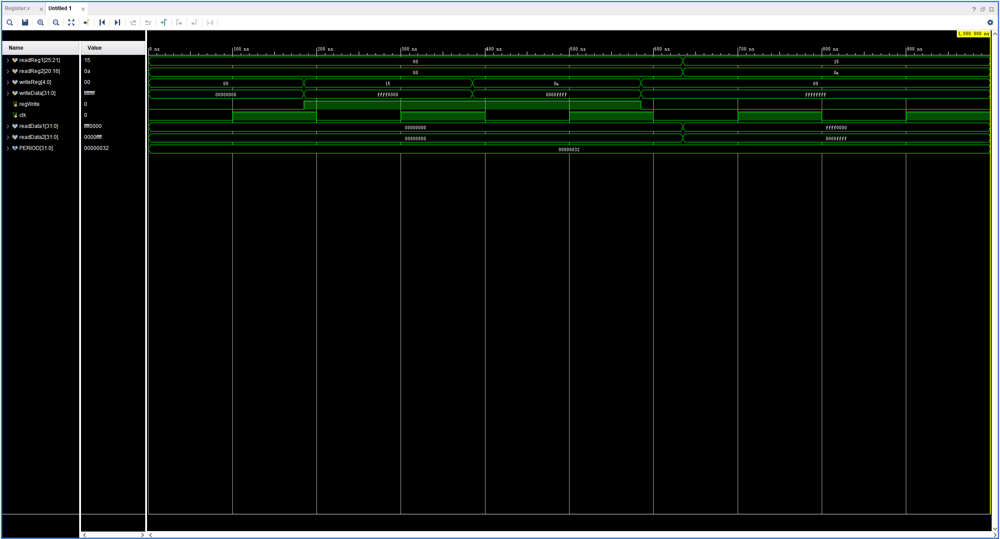
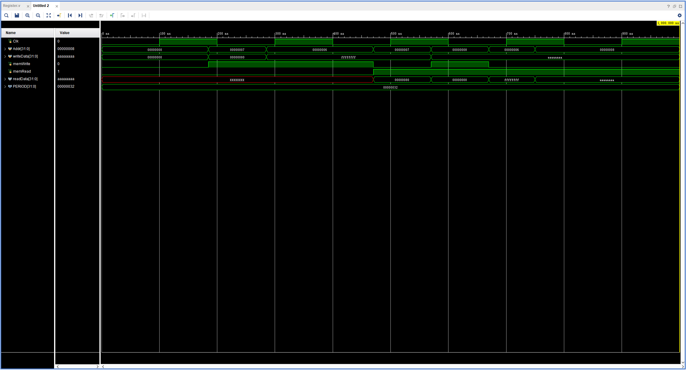
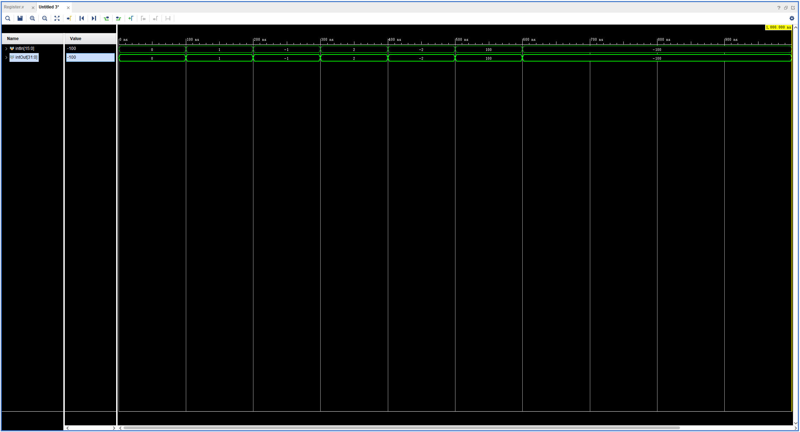

# 计算机系统结构实验报告 lab4

张鼎言 519030910133  

2021 年 6 月 6 日  

<!-- TOC -->

- [计算机系统结构实验报告 lab4](#计算机系统结构实验报告-lab4)
  - [实验摘要](#实验摘要)
  - [实验目的](#实验目的)
  - [实验原理与实现](#实验原理与实现)
    - [通用寄存器](#通用寄存器)
    - [数据储存器](#数据储存器)
    - [有符号数位扩展元件](#有符号数位扩展元件)
  - [结果验证](#结果验证)
    - [通用寄存器](#通用寄存器-1)
    - [数据存储器](#数据存储器)
    - [有符号立即数为扩展元件](#有符号立即数为扩展元件)
  - [总结与反思](#总结与反思)

<!-- /TOC -->

## 实验摘要  

本次实验实现简易MIPS处理器中三个重要部件：Register File，Data Memory File以及Sign Extend。  
实验通过Vivado软件完成，通过模拟仿真的方法验证。  

## 实验目的  

1. 理解并实现通用寄存器：register file  

2. 理解并实现数据储存器：data memory file  

3. 理解并实现有符号扩展立即数元件：Signed Extend  

## 实验原理与实现  

### 通用寄存器  

MIPS通用寄存器组由32个32位的SRAM组成，作用是暂时存放运算的中间结果或源操作数。由于寄存器文件既要读又要写，因此为了同步数据，采用时钟下降沿写。这样CPU在时钟上升沿开始一个新的周期的时候总能读出正确的结果。  

参考MIPS通用寄存器的设计，`$0`寄存器总是接地的，因此总是0. 同时为了服从整体的CPU设计，使用`assign`语句完成寄存器的读  

这里提供变量名及其含义对照表  
|变量名（端口名）|含义|
|---|---|
|rdReg1|选择读取的寄存器号|
|rdReg2|选择读取的寄存器号|
|wrtReg|选择写入的寄存器号|
|wrtData|选择写入的32位数据|
|regWrt|寄存器写入的使能信号|
|clk|CPU的时钟信号|
|reset|CPU的RESET信号|
|rdData1|读取寄存器的内容|
|rdData2|读取寄存器的内容|

具体实现如下  

```verilog
module Register(
    input [25:21] rdReg1,
    input [20:16] rdReg2,
    input [4:0] wrtReg,
    input [31:0] wrtData,
    input regWrt,
    input clk,
    input reset,
    output [31:0] rdData1,
    output [31:0] rdData2
    );
    
    reg [31:0] regFile[0:31];
    integer i;
    initial begin
    for (i = 0; i < 32;i = i + 1) regFile[i] <= 0;
    end
    
    assign rdData1 = (rdReg1 != 0) ? regFile[rdReg1] : 0;
    assign rdData2 = (rdReg2 != 0) ? regFile[rdReg2] : 0;
    
    always @ (negedge clk)
    begin
        if (reset) begin
            for (i = 0; i < 32; i = i + 1) regFile[i] <= 0;
        end
        else if (regWrt) begin
            regFile[wrtReg] <= wrtData;
            regFile[0] <= 0;
        end
    end
    
endmodule
```  

### 数据储存器  

本实验中要求实现的数据储存器，原型是DRAM，可读可写，在Harvard架构的计算机中用来存储数据。  
由于数据储存器文件既要读又要写，因此为了同步数据，采用时钟下降沿写。这样CPU在时钟上升沿开始一个新的周期的时候总能读出正确的结果。  
参考实验指导书，数据储存器采用按字寻址(word-addressing)方法，因此使用32位的`reg`类型变量实现  

这里提供变量名及其含义对照表  
|变量名（端口名）|含义|
|---|---|
|addr|选择操作的存储器地址|
|wrtData|选择写入的32位数据|
|memRd|存储器读的使能信号|
|memWrt|存储器写入的使能信号|
|clk|CPU的时钟信号|
|rdData|读取存储器的内容|

具体实现如下  

```verilog
module Memory(
    input Clk,
    input [31:0] addr,
    input [31:0] wrtData,
    input memWrt, 
    input memRd, 
    output reg [31:0] rdData
    );
    
    reg [31:0] Mem [127:0];
    integer i;
    initial begin
        for (i=0; i<127; i = i+1) Mem[i] = 0;
        $readmemh("./test/data3.txt", Mem);
    end
    
    
    always @ (*)
    begin
        rdData = Mem[addr];
    end
    
    always @ (negedge Clk)
    begin
        if (memWrt && addr)
            Mem[addr] <= wrtData;
    end

endmodule
```  

### 有符号数位扩展元件  

由于现代计算机普遍采用补码(2's complememt)，因此将有符号数从16位扩展到32位需要考虑符号位。  

具体实现时只需要按照输入有符号数的符号位进行相应扩展即可。  

```verilog
module signext(
    input [15:0] intIn,
    output reg [31:0] intOut
    );
    initial begin
        intOut = 0;
    end
    always @ (intIn)
    begin
        intOut[31:16] = 16'h0000;
        intOut[15:0] = intIn;
        if (intIn[15])
        begin
            intOut[31:16] = 16'hffff;
        end
    end
    
endmodule
```  

## 结果验证  

### 通用寄存器  

对通用寄存器组分别进行读和写操作，先写后读，观察结果  

  

寄存器组内数据读写情况受时钟信号控制，模块顺利读出了之前写入的内容，功能正常  

### 数据存储器  

对数据存储器分别进行读和写操作，先写后读，观察结果  

  

数据存储器使能信号正常，模块顺利读出了之前写入的内容，功能正常

### 有符号立即数为扩展元件  

分别对一些正数和负数进行位扩展，观察结果  

  

由于输入输出信号位数不同，值相等，可知扩展结果正确  

## 总结与反思  

1. 上升沿读，下降沿写是一个重要的设计思想。本次实验以及之后lab5和lab6的不断改进，让我最终理解并掌握了Verilog的`assign`语句及`always @`语句，这对正确编写代码十分重要  

2. 由于后面的实验要综合各个module，因此恰当的输入输出信号设计以及变量命名规范十分重要
