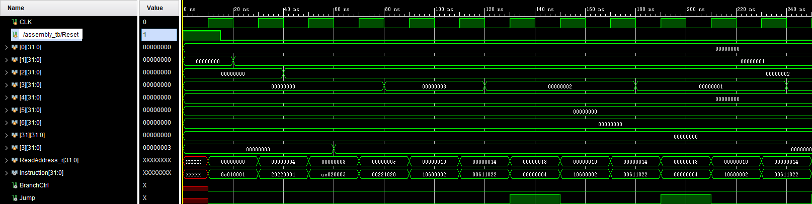
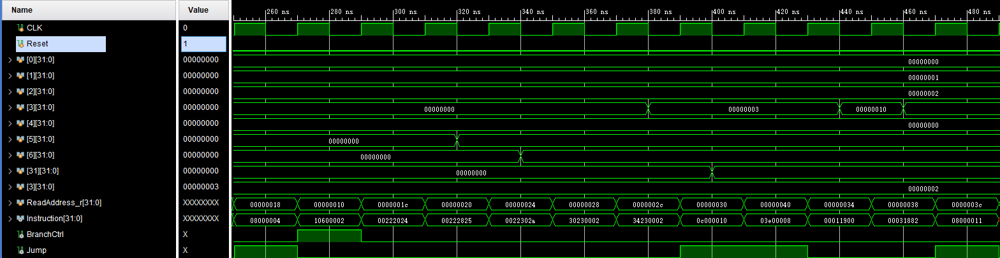

# 计算机系统结构实验报告 lab5  

张鼎言 519030910133  

2021 年 6 月 7 日  

<!-- TOC -->

- [计算机系统结构实验报告 lab5](#计算机系统结构实验报告-lab5)
  - [实验摘要](#实验摘要)
  - [实验目的](#实验目的)
  - [实验原理与实现](#实验原理与实现)
    - [Control Unit](#control-unit)
    - [ALU Control Unit](#alu-control-unit)
    - [ALU](#alu)
    - [General Register File](#general-register-file)
    - [Memory](#memory)
    - [Sign Extend](#sign-extend)
    - [Code Segment](#code-segment)
    - [Top Module](#top-module)
  - [实验结果](#实验结果)
    - [.asm](#asm)
    - [.code](#code)
    - [.data](#data)
    - [测试文件分析：](#测试文件分析)
    - [仿真结果](#仿真结果)
  - [总结与反思](#总结与反思)
  - [致谢](#致谢)

<!-- /TOC -->

## 实验摘要  

lab5要求实现一个单周期MIPS处理器，其支持16条MIPS指令  
| instruction | description |
| ---- | ---- |
| add | add two operands |
| sub | subtract two openrands |
| and | bit-wise and |
| or | bit-wise or |
| slt | set if less than |
| srl | shift right logic |
| sll | shift left logic |
| jr | jump register |
| lw | load word |
| sw | save word |
| addi | add an immediate |
| andi | bit-wise and with an immediate |
| ori | bit-wise or with an immediate |
| beq | branch if equal |
| j | jump |
| jal | jump and link |
同时导入lab3和lab4中的模块，对其功能进行相应修改最终组织为Top模块。  
通过编写测试样例以及Vivado的仿真进行结果验证。  

## 实验目的  

1. 正确理解单周期MIPS处理器的原理，以及各条指令的含义  

2. 掌握Verilog开发复杂项目的能力，理解并使用模块化开发以及自顶向下思想  

3. 增加调试能力，以及观察结果分析能力  

## 实验原理与实现  

### Control Unit  

Ctrl的作用是按照输入的指令，输出正确的控制信号。本次实验设计了以下的输出控制信号  
| 名称 | 描述 |
| --- | ---- |
| ALUSrc1 | ALU单元op1的片选信号( shamt or readData )|
| ALUSrc2 | ALU单元op2的片选信号( immediate or readData) |
| RegDst | 目标寄存器片选信号 ( rd or rt) |
| MemToReg | 是否将内存内容读取并写入寄存器 |
| MemRead | 是否需要读取内存 |
| MemWrite | 是否需要往内存写入 |
| RegWrite | 是否需要往寄存器组写入 |
| Branch | 是否条件跳转 |
| Jump | 是否无条件跳转 |
| JAL | 是否需要往$31寄存器写入PC+4 |
| ALUOp | 给ALU Ctrl的两位控制信号 |
| SignOrZero | 进行有符号扩展还是零扩展 |

```Verilog
always @ (OpCode or Func)
begin
    JAL = 0;
    casex(OpCode)
    6'b000000: // R-format
    begin
        RegDst = 1;
        AluSrc2 = 0;
        MemToReg = 0;
        RegWrite = 1;
        MemRead = 0;
        MemWrite = 0;
        Branch = 0;
        AluOp = 2'b10;
        Jump = (Func === 6'b001000) ? 1: 0;
        AluSrc1 = (Func[5:2] === 4'b0000) ? 1 : 0;
        SignOrZero = 0;
    end
    6'b100011: // lw
    begin
        RegDst = 0;
        AluSrc1 = 0;
        AluSrc2 = 1;
        MemToReg = 1;
        RegWrite = 1;
        MemRead = 1;
        MemWrite = 0;
        Branch = 0;
        AluOp = 2'b00;
        Jump = 0;
        SignOrZero = 1;
    end
    6'b101011: // sw
    begin
        RegDst = 0;
        AluSrc1 = 0;
        AluSrc2 = 1;
        MemToReg = 0;
        RegWrite = 0;
        MemRead = 0;
        MemWrite = 1;
        Branch = 0;
        AluOp = 2'b11;
        Jump = 0;
        SignOrZero = 1;
    end
    6'b00010x: // beq, bne
    begin
        RegDst = 0;
        AluSrc1 = 0;
        AluSrc2 = 0;
        MemToReg = 0;
        RegWrite = 0;
        MemRead = 0;
        MemWrite = 0;
        Branch = 1;
        AluOp = 2'b01;
        Jump = 0;
        SignOrZero = 1;
    end
    
    6'b000010: // jump
    begin
        RegDst = 0;
        AluSrc1 = 0;
        AluSrc2 = 0;
        MemToReg = 0;
        RegWrite = 0;
        MemRead = 0;
        MemWrite = 0;
        Branch = 0;
        AluOp = 2'b00;
        Jump = 1;
        SignOrZero = 0;
    end
    6'b000011: // jal
    begin
        RegDst = 0;
        AluSrc1 = 0;
        AluSrc2 = 0;
        MemToReg = 0;
        RegWrite = 1;
        MemRead = 0;
        MemWrite = 0;
        Branch = 0;
        AluOp = 2'b00;
        Jump = 1;
        SignOrZero = 0;
        JAL = 1;
    end
    6'b001xxx: // I-format
    begin
        RegDst = 0;
        AluSrc1 = 0;
        AluSrc2 = 1;
        MemToReg = 0;
        RegWrite = 1;
        MemRead = 0;
        MemWrite = 0;
        Branch = 0;
        AluOp = 2'b11;
        Jump = 0;
        SignOrZero = (OpCode[2:0] == 3'b0x0) ? 1 : 0;
    end
    default:
    begin
        RegDst = 0;
        AluSrc1 = 0;
        AluSrc2 = 0;
        MemToReg = 0;
        RegWrite = 0;
        MemRead = 0;
        MemWrite = 0;
        Branch = 0;
        AluOp = 2'b00;
        Jump = 0;
    end
    endcase
end
```

### ALU Control Unit  

ALU Ctrl依照`function code`和`ALU Op`对ALU输出相应的操作信号。其中R-type function code为指令的opcode，I-type function code为指令的高6位。  
信号产生过程如下  

1. ALUOp=2'b00 表示jump，jal和lw指令，输出加法信号  

2. ALUOp=2'b01 表示branch指令，输出减法信号  

3. ALUOp=2‘b10 表示R-type指令  

4. ALUOp=2’b11 表示I-type指令  

其中R-type指令ALUCtrlSignal与指令的关系如下
| 指令 | func filed | ALUCtrlSignal |
| --- | --- | --- |
| and | 100100 | 0000 |
| or | 100101 | 0001 |
| add | 100000 | 0010 |
| sub | 101010 | 0111 |
| sll | 000000 | 0100 |
| srl | 000010 | 0101 |
| slt | 101010 | 0111 |
| jr | 001000 | 0101 |
其中I-type指令与ALUCtrlSignal与指令关系如下
| 指令 | ALUCtrlSignal |
| --- | --- |
| addi | 0010 |
| andi | 0000 |
| ori | 0001 |

```verilog
always @ (AluOp or Func)
begin
    casex(AluOp)
    2'b00: // jump, lw, jal
    begin 
        AluCtr = 4'b0010; // add
    end
    2'b01: // beq, bne
    begin
        if (~Func[0]) // func is actually OpCode
            AluCtr = 4'b0110; // sub
        else
            AluCtr = 4'b1001; // ~sub
    end
    2'b10: // R-type
    begin
        casex(Func)
        6'b10000x: // add, addu
        begin
            AluCtr = 4'b0010;
        end
        6'b10001x: // sub, subu
        begin
            AluCtr = 4'b0110;
        end
        6'b100100: // and
        begin
            AluCtr = 4'b0000;
        end
        6'b100101: // or
        begin
            AluCtr = 4'b0001;
        end
        6'b100111: // nor
        begin
            AluCtr = 4'b1100;
        end
        6'b101010: // slt
        begin
            AluCtr = 4'b0111;
        end
        6'b101011: // sltu
        begin
            AluCtr = 4'b1000;
        end
        6'b000x00: // sll, sllv
        begin
            AluCtr = 4'b0100;
        end
        6'b000x10: // srl, srlv
        begin
            AluCtr = 4'b0101;
        end
        6'b000x11: // sra, srav
        begin
            AluCtr = 4'b1010;
        end
        6'b001000: // jr
        begin
            AluCtr = 4'b1111;
        end
        default:
        begin
            AluCtr = 4'b0110;
        end
        endcase
    end
    2'b11: // I-type, sw
    begin
        casex(Func)// Func is multiplexed by opCode
        6'b00100x: // addi, addiu
        begin
            AluCtr = 4'b0010;
        end
        6'b001100: // andi
        begin
            AluCtr = 4'b0000;
        end
        6'b001101: // ori
        begin
            AluCtr = 4'b0001;
        end
        6'b001110: // xori
        begin
            AluCtr = 4'b1101;
        end
        6'b001010: // slti
        begin
            AluCtr = 4'b0111;
        end
        6'b001011: // sltiu
        begin
            AluCtr = 4'b1000;
        end
        6'b001111: // lui
        begin
            AluCtr = 4'b1110;
        end
        6'b101011: //sw
        begin
            AluCtr = 4'b0010; // add
        end
        endcase 
    end
    endcase
end
```

### ALU  

ALU依照ALUCtrlSignal对两个输入进行相应运算，输出结果与flag信号(Zero flag和lab6中实现的 Overflow flag) 

```verilog
always @ (AluCtr or op1 or op2)
begin
    JR = 0;
    case(AluCtr)
    4'b0000: // and, andi
    begin
        AluRes = op1 & op2;
    end
    4'b0001: // or, ori
    begin
        AluRes = op1 | op2;
    end
    4'b0010: // add, addu
    begin
        { OF, AluRes } = op1 + op2;
    end
    4'b0110: // sub, subu
    begin
        { OF, AluRes } = op1 - op2;
    end
    4'b1001: // ~sub
    begin
        AluRes = ~(op1 - op2);
    end
    4'b0111: // slt
    begin
        sOp1 = op1;
        sOp2 = op2;
        if (sOp1 < sOp2)
            AluRes = 1;
        else
            AluRes = 0;
    end
    4'b1000: // sltu
    begin
        AluRes = (op1 < op2) ? 1: 0;
    end
    4'b1100: // nor
    begin
        AluRes = ~(op1 | op2);
    end
    4'b1101: // xor
    begin
        AluRes = op1 ^ op2;
    end
    4'b0101: // srl *
    begin
        AluRes = op2 >> op1;
    end
    4'b1010: // sra
    begin
        sOp2 = op2;
        AluRes = sOp2 >>> op1;
    end
    4'b0011: // ret op1
    begin
        AluRes = op1;
    end
    4'b0100: // sll
    begin
        AluRes = op2 << op1;
    end
    4'b1110: // lui
    begin
        AluRes[31:16] = op2[15:0];
        AluRes[15: 0] = 0;
    end
    4'b1111: // jr
    begin
        AluRes = op1;
        JR = 1;
    end
    endcase
end
```

### General Register File  

与lab4的设计完全相同。  

寄存器读操作不受影响，写操作只能在时钟下降沿进行。  

参考了MIPS的设计，`$0寄存器`接地，因此总是0

```verilog
assign rdData1 = (rdReg1 != 0) ? regFile[rdReg1] : 0;
assign rdData2 = (rdReg2 != 0) ? regFile[rdReg2] : 0;

always @ (negedge clk)
begin
    if (reset) begin
        for (i = 0; i < 32; i = i + 1) regFile[i] <= 0;
    end
    else if (regWrt) begin
        regFile[wrtReg] <= wrtData;
        regFile[0] <= 0;
    end
end
```

### Memory  

与lab4的设计完全相同。  

数据段内存读操作不受影响，写操作只能在时钟下降沿进行。

```verilog
always @ (*)
begin
    rdData = Mem[addr];
end

always @ (negedge Clk)
begin
    if (memWrt && addr)
        Mem[addr] <= wrtData;
end
```

### Sign Extend  

与lab4的设计完全相同。

需要注意的是，有符号扩展单元的SignExt会与ZeroExt通过一个由SignOrZero片选的Mux，最终成为Extend的结果送往由ALUSrc2片选的Mux  

### Code Segment  

在Top模块内用`reg`数据类型实现了一个ROM，在0时刻使用`$readmemh`命令往里读入指令。  

本次实验的设计为了与实验指导书相符，寄存器、数据段内存和代码段内存均采用32-bit字长的word寻址（而不是byte寻址）  

```verilog
// 指令内存段
reg [31:0] CodeSegment[0:127];

initial begin
    $readmemb("./test/code2.txt", CodeSegment);
end
```

### Top Module  

在Top module实例化上述各个部分的元件  

使用Verilog的`assign`语句以及问号冒号表达式`cond ? expr1 : expr2`表示多路复用器(Multiplexer)  

使用Verilog的`assign`语句连接Branch和Jump信号到Instruction fetch元件

使用`assign`语句完成剩余的shift left2操作与PC+4操作  

以上连线都完成后，在每一个时钟上升沿更改PC的值，同时开始新的周期。  

```verilog
assign Instruction = CodeSegment[ReadAddress_r >> 2];
assign JumpAddress = JumpReg ? ALUResult : {NextAddress[31:28], Instruction[25:0]<<2};
assign BranchAddress = (SignExtOut<<2) + NextAddress;
assign NextAddress = ReadAddress_r + 4;
assign Shamt[5:0] = Instruction[10:6];
assign Shamt[31:6] = 0;
assign ZeroExtOut = {16'h0000, Instruction[15:0]};
assign WriteReg = JumpAndLink ? 5'b11111 : ( RegDst ? Instruction[15:11] : Instruction[20:16] );
assign BranchCtrl = Branch & Zero;
assign BranchTakeAddress = BranchCtrl ? BranchAddress : NextAddress;
assign Function = (ALUOp == 2'b11) ? Instruction[31:26] : Instruction[5:0];
assign ExtOut = SignOrZero ? SignExtOut : ZeroExtOut;
assign ALUOperand1 = ALUSrc1 ? Shamt : ReadData1;
assign ALUOperand2 = ALUSrc2 ? ExtOut : ReadData2;
assign WriteData = JumpAndLink ? NextAddress : ( MemToReg ? MemReadData : ALUResult );

always @ (posedge CLK)
begin
    if (Reset) ReadAddress_r = 32'h00000000;
    else begin
    ReadAddress_r = Jump ? JumpAddress : BranchTakeAddress;
    end
end
```

完整的代码请见工程文件。

## 实验结果  

本次实验采用Vivado仿真的方法验证结果。先编写激励文件，由于在单周期 MIPS CPU中实现了Reset功能，因此可以在激励文件中先打开Reset，关闭后CPU自动开始运行  

```verilog
module assembly_tb(    );
    reg CLK, Reset;

    Top CPU(
        .CLK(CLK),
        .Reset(Reset)
    );

    parameter CYCLE = 10;
    always #(CYCLE) CLK = ~CLK;

    initial begin
        CLK = 0;
        Reset = 1;
        #15 Reset = 0;
    end

endmodule
```

测试文件共测试16条指令  

### .asm

```mips
0: lw $1 1($0)
4: addi $2 $1 1
8: sw $2 3($0)
c: add $3 $1 $2
10: beq $0 $3 2
14: sub $3 $3 $1
18: j 4
1c: and $4 $1 $2
20: or $5 $1 $2
24: slt $6 $1 $2
28: andi $3 $1 2
2c: ori $3 $1 2
30: jal 40
34: sll $3 $1 4
38: srl $3 $3 2
3c: j 44
40: jr $31
```  

### .code  

    10001100000000010000000000000001
    00100000001000100000000000000001
    10101100000000100000000000000011
    00000000001000100001100000100000
    00010000011000000000000000000010
    00000000011000010001100000100010
    00001000000000000000000000000100
    00000000001000100010000000100100
    00000000001000100010100000100101
    00000000001000100011000000101010
    00110000001000110000000000000010
    00110100001000110000000000000010
    00001100000000000000000000010000
    00000000000000010001100100000000
    00000000000000110001100010000010
    00001000000000000000000000010001
    00000011111000000000000000001000

### .data  

    00000000
    00000001
    00000002
    00000003
    00000004
    00000005
    00000006
    00000007
    00000008
    00000009
    0000000a
    0000000b
    0000000c
    0000000d
    0000000e
    0000000f  

### 测试文件分析：

1. 从0xc到0x14这三条指令是一个循环  

2. 位于0x30的指令相当于调用一个只有`return`语句空函数，位于0x40的语句相当于x86中的`RET`

3. 其余代码均顺序执行，检查相应寄存器/内存值变化即可验证正确性  

### 仿真结果  

由于运行时间较长，使用两张图片分别展示前250ns和后250ns的波形  

  

  

图中自上到下分别为`$0~$6`号以及`$31`寄存器,地址为3的内内存，测试sw用的内存地址以及PC（*ReadAddress_r*）和branch/jump使能信号。  

通过观察各个寄存器文件的变化以及PC的变化可以发现，程序运行情况与汇编相同。仿真实验验证成功。  

## 总结与反思  

这个实验加深了我对Computer architecture课程中讲解的CPU的理解，在完成实验过程中，学习了很多Verilog的知识与语法，增强了对Verilog的兴趣。  

本次实验困难的地方在于如何搭建CPU以及如何调试。我并没有采用引进其它模块的方法，而是观察电路图，在Top module中连线。Vivado调试的好处在于，可以监视任意需要的信号，而不需要像调试`C++`的时候使用gdb并配置相关文件；坏处是，HDL语言的执行不是顺序的，也没有高级语言的“对象”的概念。  

本次实验同时让我意识到良好的代码风格对于维护、调试项目至关重要。  

## 致谢

特别感谢老师和助教为我们检查代码运行结果。  

同时也要感谢同学们的耐心帮助与鼓励。
