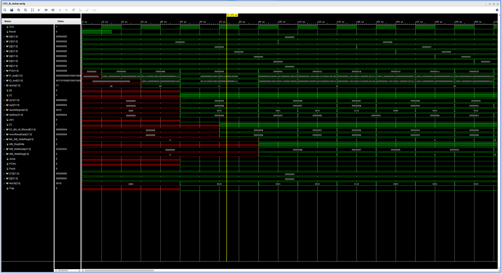
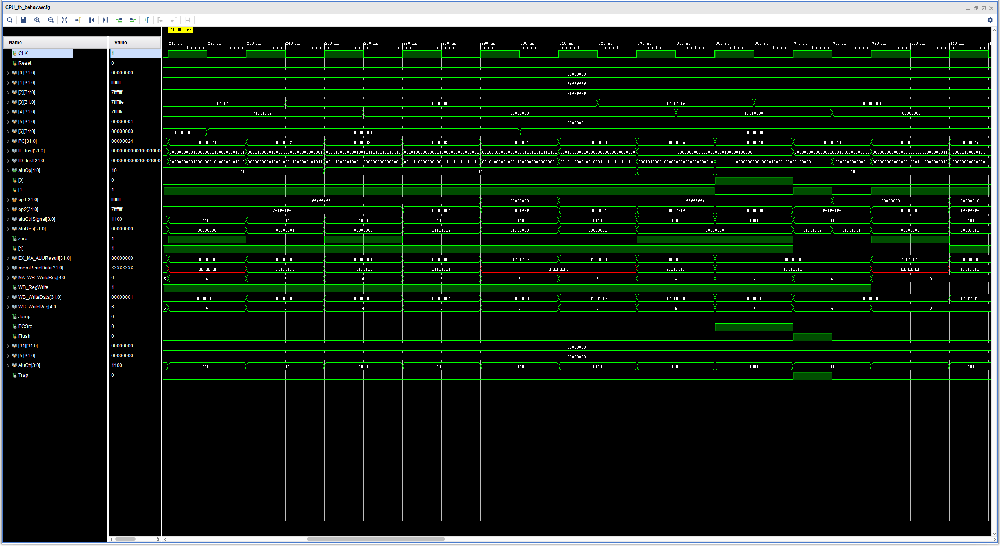

# 计算机系统结构实验报告 lab6

张鼎言 519030910133

2021 年 6 月 8 日

<!-- TOC -->

- [计算机系统结构实验报告 lab6](#计算机系统结构实验报告-lab6)
  - [实验摘要](#实验摘要)
  - [实验目的](#实验目的)
  - [实验原理](#实验原理)
    - [CPU Pipelining](#cpu-pipelining)
    - [Hazard](#hazard)
  - [功能实现](#功能实现)
    - [IF 阶段设计](#if-阶段设计)
    - [ID 阶段设计](#id-阶段设计)
    - [EX 阶段设计](#ex-阶段设计)
    - [MA 阶段设计](#ma-阶段设计)
    - [WB 阶段设计](#wb-阶段设计)
  - [结果验证](#结果验证)
    - [正确性测试](#正确性测试)
      - [.asm](#asm)
      - [.code](#code)
      - [.data](#data)
      - [结果分析](#结果分析)
    - [31条指令扩展测试](#31条指令扩展测试)
      - [.asm](#asm-1)
      - [.code](#code-1)
      - [.data](#data-1)
      - [结果分析](#结果分析-1)
  - [总结与反思](#总结与反思)
  - [鸣谢](#鸣谢)

<!-- /TOC -->

## 实验摘要

lab6要求实现一个简单的类MIPS多周期流水处理器，支持**forwarding技术解决data hazard**，避免插入过多空指令减少pipeline stall，支持**使用predict-not-taken预测分支跳转**，减少分支指令导致的control hazard降低流水线throughput，最终完善设计并**支持31条MIPS指令**。  

实验使用Vivado软件进行，并通过仿真的方法验证。  

## 实验目的  

1. 理解掌握CPU pipeline技术，理解流水线实现，实现一个基础pipelined CPU  

2. 理解hazard，理解流水线如何检测data hazard和control hazard，在此基础上增加控制信号，使得流水线支持Stall功能，进而通过插入空指令的方法解决data hazard和control hazard  

3. 理解掌握forwarding技术，在此基础上添加控制信号，在检测到data hazard的时候使用forwarding技术，减少流水线stall的次数，提高流水线性能  

4. 理解掌握分支预测修技术，在此基础上改流水线，采用predict-not-taken解决control hazard，减少流水线stall的次数，提高流水线的性能  

## 实验原理  

### CPU Pipelining

Pipeline技术可以让CPU在同一时刻使用不同的部件执行不同指令，从而提高吞吐率。通过恰当划分执行阶段并提高时钟周期，虽然不能减少单条指令的latency，但是CPU可以显著缩短一个程序的执行时间。

  

本次实验采取五级流水，将每条指令的执行分成五个阶段，分别是IF（instruction fetch），ID（instruction decode），EX（execution），MA（memory access)和WB(write back)

### Hazard  

实现流水线以后，由于指令执行阶段的重叠，有可能出现由于本条指令尚未执行完成导致接下来的指令无法执行的情况，称之为hazard. RISC pipeline一共有三种hazard，分别是  

1. Structual hazard 如果连续的不同指令需要相同的硬件，那么由于前一条指令没有执行完毕，后一条指令不能执行  

2. Data hazard 如果一条指令需要前一条指令产生的数据，而前一条指令还没有执行完毕，这个数据还没有产生，因此后一条指令不能执行  

3. Control hazard 如果一条分支/跳转指令还没有执行完毕，下一条指令的位置就不能确定，从而无法执行  

本次实验不需要考虑Structual hazard及相关的寄存器换名等因素，只需要解决data hazard和control hazard就行。  

解决data hazard的方法是forwarding，也就是将前一条指令在EX或MA阶段计算出但尚未写回到寄存器里的结果通过bypass模块转发给之后需要走这个数据的下一条指令，这样子可以避免流水线stall  

解决control hazard的方法是predict-not-taken加上pipeline flush，总是预测分支不跳转，进而加载下一条指令并执行。由于我把分支检测放到了EX阶段，因此如果预测正确，可以避免流水线stall；反之如果预测错误，需要flush模块洗掉错误加载进来的两条指令。  

## 功能实现  

### IF 阶段设计  

在IF阶段，需要完成PC的取值。  
我的设计中使用了按字(word)寻址的寄存器变量`CodeSegment`存储指令，采用RISC机器采用的将指令内存和数据内存分开的Harvard架构。  
在取值完毕后，在IF阶段添加一个固定的加法器计算出下一条指令的地址PC+4
最后将结果存入`IF_ID`段寄存器内

```verilog
/********** IF ***********/
// IF interface
wire [31:0] JumpAddr;
wire [31:0] BranchAddr;
wire PCSrc;
wire Jump; // from EX, serve as selection signal for IF and stall signal for ID
reg [31:0] IF_ID_NextAddr;
reg [31:0] IF_ID_Inst;

// IF internal circuit
// ROM
reg [31:0] CodeSegment[0:127];
reg [31:0] PC;

wire [31:0] IF_NextAddr;
wire [31:0] IF_Inst;
assign IF_NextAddr = PC + 4;
assign IF_Inst = CodeSegment[PC >> 2];
```  

在时钟上升沿完成取指，这里分三种情况：、

1. RESET信号，表明CPU的RESET引脚激活，因此PC应该被清零

2. 如果PCSrc信号存在，说明PC需要被外部信号重置而不是取PC+4，通过Jump信号片选到底导致PC重置的是跳转指令还是分支指令，PC设置完输出Flush信号洗掉前两条错误加载的指令  

3. PC顺序取值，取PC+4. 注意，我的代码采用了Verilog的阻塞赋值运算符，因此PC+4总是在PC改变后才重新计算的  

```verilog
if (!Stall) begin
    // set PC
    if (RESET) begin
        PC = 32'h00000000; // 别的也要set
    end
    else if (PCSrc) begin
        PC = Jump ? JumpAddr : BranchAddr;
        Flush = 1;
    end
    else begin
        PC = IF_NextAddr;
    end

    // set IF_ID pipeline register
    IF_ID_NextAddr <= IF_NextAddr;
    IF_ID_Inst <= IF_Inst;
end

// set IF_ID pipeline register
IF_ID_NextAddr <= IF_NextAddr;
IF_ID_Inst <= IF_Inst;
```  

由于我选择在时钟上升沿开启一个新的CPU cycle，因此我在时钟下降沿检查Flush信号并洗掉段寄存器取消错误取出的两条指令。  

```verilog
if (Flush) begin
    IF_ID_NextAddr <= 0;
    IF_ID_Inst <= 0;

    ID_EX_EXCtrl <= 0;
    ID_EX_MACtrl <= 0;
    ID_EX_WBCtrl <= 0;
    ID_EX_ReadData1 <= 0;
    ID_EX_NextAddr <= 0;
    ID_EX_JumpAddr <= 0;
    ID_EX_SignExt <= 0;
    ID_EX_ZeroExt <= 0;
    ID_EX_Shamt <= 0;
    ID_EX_Func <= 0;
    ID_EX_RD <= 0;
    ID_EX_RT <= 0;

    Flush <= 0;
end
```

### ID 阶段设计  

首先使用`reg`变量设计`ID_EX`段寄存器，我将不同阶段需要用的控制信号放到了相应的寄存器变量中

```verilog
/*********** ID ***********/
// ID interface
wire WB_RegWrite;
wire [4:0] WB_WriteReg;
wire [31:0] WB_WriteData;
reg [8:0] ID_EX_EXCtrl; // { RegDst, ALUSrc1, ALUSrc2, SignOrZero, [1:0]ALUOp, Jump, JAL, Branch}
reg [1:0] ID_EX_MACtrl; // { MemWrite, MemRead }
reg [1:0] ID_EX_WBCtrl; // { RegWrite, MemToReg }
reg [31:0] ID_EX_ReadData1;
reg [31:0] ID_EX_ReadData2;
reg [31:0] ID_EX_NextAddr;
reg [31:0] ID_EX_JumpAddr;
reg [31:0] ID_EX_SignExt;
reg [31:0] ID_EX_ZeroExt;
reg [31:0] ID_EX_Shamt;
reg [5:0] ID_EX_Func;
reg [4:0] ID_EX_RD;
reg [4:0] ID_EX_RT;
```  

然后实例化之前实验的使用的元件：Ctrl Unit，Register File以及Sign Extension Unit  
继承之前顺序元件的所有设计
这里做了修改的是Ctrl Unit，将新增加的arithmetic/logic指令输出相应的(与原有16条指令中运算相同的)控制信号，R-type指令中需要区分shift与shift-v来生成正确的操作数片选信号，除此之外R-type和I-type其他指令不需要特殊的考虑，同时将beq和bne也输出相同的控制信号。置于如何实现不同的功能，放到EX阶段中让ALU Ctrl Unit实现  

同时ID阶段需要接受forwarding模块的信号，来判断通过通用寄存器文件读出的数据是否需要bypass  

```verilog
ID_EX_ReadData1 <= ( // MA_ID data hazard
    !(EX_MA_WriteReg === ID_Inst[25:21]
        && EX_MA_WBCtrl[1])
    ) ? bypassData1 : (
    EX_MA_WBCtrl[0] ? memReadData : EX_MA_ALUResult
);
ID_EX_ReadData2 <= ( // MA_ID data hazard
    !(EX_MA_WriteReg === ID_Inst[20:16]
        && EX_MA_WBCtrl[1])
    ) ? bypassData2 : (
    EX_MA_WBCtrl[0] ? memReadData : EX_MA_ALUResult
);
```  

这里先通过需要写回的寄存器号判断是否有内存读的data hazard，如果有bypass数据，否则得到已经完成EX阶段bypass（如果需要）的数据  

```verilog
/******** Forwarding ********/
assign bypassData1 = ( // EX_ID data hazard
            !((( ID_EX_EXCtrl[1] ? 5'b11111 : (ID_EX_EXCtrl[8] ? ID_EX_RD : ID_EX_RT) ) === ID_Inst[25:21])
                && ID_EX_WBCtrl[1]) // ID_EX pipeline register is stalled with data hazard
        ) ? readData1 : (
            ID_EX_WBCtrl[0] ? memReadData : aluResult // source is memory or ALU
        );
assign bypassData2 = ( // EX_ID data hazard
            !((( ID_EX_EXCtrl[1] ? 5'b11111 : (ID_EX_EXCtrl[8] ? ID_EX_RD : ID_EX_RT) ) === ID_Inst[20:16])
                && ID_EX_WBCtrl[1]) // ID_EX pipeline register is stalled with data hazard
        ) ? readData2 : (
            ID_EX_WBCtrl[0] ? memReadData : aluResult // source is memory or ALU
        );
```  

### EX 阶段设计  

首先用`reg`变量开好EX_MA段寄存器

```verilog
/*********** EX ***********/
// EX interface
wire Trap;
reg [1:0] EX_MA_MACtrl; // { MemWrite, MemRead }
reg [1:0] EX_MA_WBCtrl; // { RegWrite, MemToReg }
reg [31:0] EX_MA_ALUResult;
reg [31:0] EX_MA_WriteData;
reg [31:0] EX_MA_NextAddr;
reg [4:0] EX_MA_WriteReg;
```

然后完成内部的接线，`zero`和`jr`与之前实验完全相同，`of`表示overflow flag，为了体现add和addu的区别，参考MIPS真正的实现，我对add增加了溢出的判断，并且增加了一个ALU给CPU输出的Trap信号，表示如果有溢出发生，操作系统应该进行异常处理。不过本次实验没有要求CPU具有异常处理的功能，我就只保留了信号没有实现异常处理。  

在EX阶段生成真正的跳转地址JumpAddr与分支地址EX_BranchAddr（并最终传送到BranchAddr），并且通过判断分支或跳转是否发生产生正确的PCSrc的片选信号。因此分支跳转指令的EX阶段结束后下一周期PC就能选出正确的地址了。

```verilog
// EX internal circuit
wire zero;
wire of;
wire jr;
wire [3:0] aluCtrlSignal;
wire [31:0] aluOprd1;
wire [31:0] aluOprd2;
wire [31:0] EX_BranchAddr;
wire [31:0] aluResult;

assign aluOprd1 = (ID_EX_EXCtrl[7]) ? ID_EX_Shamt : ID_EX_ReadData1;
assign aluOprd2 = (ID_EX_EXCtrl[6]) ? (ID_EX_EXCtrl[5] ? ID_EX_SignExt : ID_EX_ZeroExt) : ID_EX_ReadData2;

assign EX_BranchAddr = (ID_EX_SignExt << 2) + ID_EX_NextAddr; // 因为总是预测不跳，所以这里只需要提供跳的地址
assign Jump = ID_EX_EXCtrl[2];
assign PCSrc = (zero & ID_EX_EXCtrl[0]) | ID_EX_EXCtrl[2];
assign JumpAddr = jr ? aluResult : ID_EX_JumpAddr;
assign BranchAddr = EX_BranchAddr;

assign Trap = ~ID_EX_Func[0] & of;
```  

最后实例化ALU和ALU Ctrl，将16条指令扩展成31条的时候，大部分指令只需要简单增加对func码的判断（注意，我在实现lab5的时候就将I-type指令的opcode当作func码传给了ALU Ctrl Unit了）。

少量需要注意并进行相应更改的是：

1. 实现算数右移和逻辑右移的时候，要用`Verilog`的`>>`和`>>>`运算符分别进行逻辑右移和算数右移。

2. 实现slt和sltu的时候，我使用了Verilog的关键字`signed`，在ALU内部开两个32位的signed的临时变量。由于Verilog的数据类型默认是无符号数，因此执行sltu的时候直接使用`<`比较，执行slt的时候先进行有符号数到无符号数的赋值，然后对赋值完成的无符号数使用'<'比较并根据结果设置正确的值。  

3. 实现bne的时候，我的设计是给ALU增加一个“减法取反”的运算，这样就可以输出正确的zero信号了。  

具体的指令扩展细节请见工程文件。  

### MA 阶段设计  

首先使用`reg`变量开MA_WB段寄存器

然后实例化之前实验中使用的内存

```verilog
/*********** MA ***********/
// MA interface
reg [1:0] MA_WB_WBCtrl;
reg [4:0] MA_WB_WriteReg;
reg [31:0] MA_WB_MemReadData;
reg [31:0] MA_WB_ALUResult;
reg [31:0] MA_WB_NextAddr;

// MA internal circuit
wire [31:0] memReadData;
```  

由于内存读要在第四个周期才能产生正确数据，因此内存读导致的data hazard必须stall下一条指令一个周期。  

这里附上包含stall检测在内的完整stall模块的代码

```verilog
always @(negedge CLK) begin

    if (Stall) begin
        Stall <= 0;
    end
    else if (
        ((( ID_EX_EXCtrl[1] ? 5'b11111 : (ID_EX_EXCtrl[8] ? ID_EX_RD : ID_EX_RT) ) === ID_Inst[25:21]) ||
            (( ID_EX_EXCtrl[1] ? 5'b11111 : (ID_EX_EXCtrl[8] ? ID_EX_RD : ID_EX_RT) ) === ID_Inst[20:16]))
        && ID_EX_WBCtrl[1] && ID_EX_WBCtrl[0]
    ) begin
        Stall <= 1;
    end
    else begin
        Stall <= 0;
    end

end
```  

由于我将时钟上升沿作为CPU cycle开始的标志，在时钟上升沿每一个阶段读取段寄存器的内容并执行。因此我选择在时钟下降沿进行stall的检测及Stall的设置与恢复。注意，这里对Stall变量采用Verilog的`<=`非阻塞赋值运算符，可以避免执行冲突。 

### WB 阶段设计  

WB阶段不需要做特殊处理，沿用之前sequential CPU的设计就可以了  

```verilog
/*********** WB ***********/
assign WB_WriteData = (MA_WB_WriteReg === 5'b11111) ? MA_WB_NextAddr : (
    MA_WB_WBCtrl[0] ? MA_WB_MemReadData : MA_WB_ALUResult
);
assign WB_RegWrite = MA_WB_WBCtrl[1];
assign WB_WriteReg = MA_WB_WriteReg;
```  

先判断是否需要写回通用寄存器文件，如果是JR指令（根据MIPS指令的说明，JR指令只能存入`$31`寄存器），则写入地址，反之写入数据。  

## 结果验证  

### 正确性测试  

本次实验采用Vivado仿真的方法验证结果。先编写激励文件，由于在MIPS CPU中实现了Reset功能，因此可以在激励文件中先打开Reset，关闭后CPU自动开始运行  

正确性测试包含16条指令，同时包含Stall，forwarding以及branch-not-taken  

#### .asm  

```mips
0: lw $1 4($0)
4: ori $2 $1 7
8: add $3 $1 $2
c: sub $4 $2 $1
10: and $5 $3 $4
14: or $6 $3 $4
18: lw $1 1($0)
1c: lw $2 5($0)
20: beq $2 $0 2
24: sub $2 $2 $1
28: j 8
2c: addi $1 $0 10
30: sw $1 5($0)
34: andi $1 $1 8
38: slt $2 $1 $3
3c: j 18
40: addi $1 $0 15
44: jr $31
48: jal 16
4c: sll $2 $1 4
50: srl $2 $1 2
```  

#### .code

    10001100000000010000000000000100
    00110100001000100000000000000111
    00000000001000100001100000100000
    00000000010000010010000000100010
    00000000011001000010100000100100
    00000000011001000011000000100101
    10001100000000010000000000000001
    10001100000000100000000000000101
    00010000000000100000000000000010
    00000000010000010001000000100010
    00001000000000000000000000001000
    00100000000000010000000000001010
    10101100000000010000000000000101
    00110000001000010000000000001000
    00000000001000110001000000101010
    00001000000000000000000000010010
    00100000000000010000000000001111
    00000011111000000000000000001000
    00001100000000000000000000010000
    00000000000000010001000100000000
    00000000000000010001000010000010  

#### .data  

    00000000
    00000001
    00000002
    00000003
    00000004
    00000005
    00000006
    00000007
    00000008
    00000009
    0000000a
    0000000b
    0000000c
    0000000d
    0000000e
    0000000f  

#### 结果分析  

仿真结果如下,由于pipeline CPU需要的时钟周期较多，因此每幅图展示200nm的结果  

  
  
  
  
  
  

本次仿真中，第1条指令的load和第2条指令的ori构成内存读的data hazard，通过PC在8位置待了两个周期可以说明发生了stall，可以验证stall功能和内存读的forwarding功能的正确性。  

第2条ori和第3条add构成了EX阶段的data hazard，和第4条sub构成了MA阶段的data hazard，通过观察`$3`和`$4`可以发现其结果正确，从而验证forwarding功能的正确性  

位于20的beq和位于28的jump指令构成了一个空循环，使用`$2`寄存器作为count register（位于24的sub指令实现），共循环5次，观察PC的值可以发现我采用了predict-not-taken技术，该技术正确实现并提升了流水线性能  

同样观察PC可以发现，由于我的实现没有明确区分Jump和Branch，对于Jump没有采用Stall流水线而是采用Flush流水线的方法处理，观察其他寄存器的值（除了`$2`没有发生变化）以及Flush信号可以说明Flush功能的正确性  

综上，pipeline CPU的功能全部正确实现!  

### 31条指令扩展测试  

31条指令扩展测试包括新扩展的15条指令以及一些原有的16条指令与之形成对比  

#### .asm

```mips
0: lw $1 0($0)
4: lw $2 1($0)
8: add $3 $1 $2
c: addu $4 $1 $2
10: addi $5 $1 2
14: addiu $6 $1 2
18: xor $3 $1 $2
1c: nor $4 $1 $2
20: slt $5 $1 $2
24: sltu $6 $1 $2
28: xori $3 $1 1
2c: lui $4 0xffff
30: slti $3 $1 1
34: sltiu $4 $1 0x7fff
38: bne $1 $0 0x1
3c: nop
40: nop
44: srl $3 $1 16
48: sra $4 $1 16
4c: lw $30 2($0)
50: sllv $5 $1 $30
54: srlv $6 $1 $30
58: srav $3 $1 $30
```  

#### .code  

    10001100000000010000000000000000
    10001100000000100000000000000001
    00000000001000100001100000100000
    00000000001000100010000000100001
    00100000001001010000000000000010
    00100100001001100000000000000010
    00000000001000100001100000100110
    00000000001000100010000000100111
    00000000001000100010100000101010
    00000000001000100011000000101011
    00111000001000110000000000000001
    00111100000001001111111111111111
    00101000001000110000000000000001
    00101100001001000111111111111111
    00010100001000000000000000000010
    00000000001000010000100000100000
    00000000001000010000100000100000
    00000000000000010001110000000010
    00000000000000010010010000000011
    10001100000111100000000000000010
    00000011110000010010100000000100
    00000011110000010011000000000110
    00000011110000010001100000000111

#### .data  

    ffffffff
    7fffffff
    00000001  

#### 结果分析  

仿真结果如下,由于pipeline CPU需要的时钟周期较多，因此每幅图展示200nm的结果  

  
  
  

由于我数据设计的巧妙，位于数据内存0的字ffffffff和位于数据内存1的字7fffffff分别是最大的无符号数和最大的有符号数，因此位于8和c的add，addu和位于10和14的指令addi和addiu分别会/不会产生Trap信号，因此addu设计正确  

观察`$5``$6`寄存器可知，对于相同的操作数，位于20和24的slt和sltu指令分别设置/没设置目标寄存器的值（`$5`在被位于10的指令加到1以后不变，`$6`从1变成0），因此sltu设计正确  

位于38的bne跳过了紧接着的两条nop，我在实现的时候（.code中）nop并不是全零，而是会改变寄存器值的加法，通过Flush信号和观察到没有寄存器的值改变可以说明bne功能正确  

最后通过观察寄存器值的变化（我反复用了`$3``$4``$5``$6`这四个寄存器）可以说明，其余所有的新加的arithmetic/logic指令执行正确  

综上，本次实验所有任务圆满完成！  

## 总结与反思  

本次实验实现的完整MIPS pipelined CPU，支持以下功能  

- [x] 支持31条指令  
- [x] 支持stall机制
- [x] 支持forwarding功能
- [x] 支持predict-not-taken功能
- [x] 支持flush功能  

我的实现思路的独特之处在于，面对Jump没有采取Stall的方法，然后将复杂指令交给ALU Ctrl Unit去控制，在Ctrl Unit处不区分。这样的好处是很大程度复用了元件，而不至于添加额外的元器件。  

我代码编写的独特之处在于，由于对pipelined CPU掌握比较扎实，我没有写Verilog意义上的module，而是把forwarding功能，flush功能以及stall功能全部在Top module里面通过连线或者恰当的赋值实现，这样减小了代码量，同时减小了调试难度，配合注释及合理的变量名，显得十分简洁。  

与其他同学交流之后，我发现其他同学有人将分支预测提前到了ID阶段以提高性能。通过这次实验，我对计算机系统设计中性能和成本的trade off有了更深刻的认识，因为想要更好的性能就需要使用更加sophisticated的方法，添加元器件与控制信号，从而开发增加成本，降低系统鲁棒性。RISC芯片本来就以间接性著称，广泛使用于嵌入式系统中，因此为了极致的性能添加一套额外的ALU单元不一定是一个很合适的设计。  

## 鸣谢  

圆满完成所有实验的所有任务，对自己而言也是一个小成就。  

要特别感谢CS143的课程组给我们提供了良好的学习实验环境，感谢老师和助教为我们检查代码运行结果。  

同时也要感谢同学们的耐心帮助与鼓励。